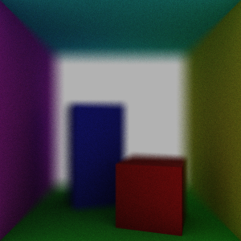

# thinlens-pathtracer
"thinlens-pathtracer" is a simple path tracer that uses a perspective camera 
following the thin-lens approximation. The camera is more sophisticated 
compared to naive pinhole-based implementations, and can achieve effects such 
as depth of field (due to the lens-based camera system) and anti-aliasing (due 
to slight perturbations for each sampled camera ray of a certain pixel). 

## Running the Renderer
To run the renderer, first construct makefiles for the renderer by using 
`cmake` in `thinlens-pathtracer/src/`:

    cmake CMakeLists.txt

This will create a makefile for the renderer. To compile the 
renderer, use make:

    make

To run the renderer, execute the executable as follows:

    ./ThinlensRender

The camera has a default orientation, but it can be altered 
interactively using a debug mode (see below for more information).

## Contents
There will be two applications: A debug mode and a render mode. 

The debug mode uses "classic" ray tracing (not recursive) to 
display the scene and change orientation and lens configuration
of the camera interactively. This reaches interactive speed due 
to the use of basic, non-recursive ray tracing. Exiting the debug 
mode will write the camera orientation to standard output, which 
could later be used in the render mode. 

The render mode uses a naive path tracing algorithm that only 
handles lambertian surfaces, and assumes the model is 
surrounded by daylight. Providing camera orientation and lens 
configuration via the debug mode is done by piping a camera 
configuration file from the debug mode to the executable. 
Alternatively, you could simply pipe the debug mode to the 
render mode `./ThinlensDebug | ./ThinlensRender`.

## Requirements
### Debug Mode:
SDL is used to facilitate realtime rendering and camera 
interaction through mouse and keyboard inputs.
* `SDL 1.2` (later versions may or may not be compatible)
* `c++11`
* `CMake`

### Render Mode:
The render mode deliberately avoids SDL in order to reduce 
the number of dependencies needed to run the application.
* `c++11`
* `CMake`

## Possible Extensions 
* Reading a model from an input file;
* More robust material data structures;
* More material properties:
    1. Specular material;
    2. Translucent material;
    3. Refraction through material.

## Resources
* [PBRT](http://www.pbr-book.org/3ed-2018/contents.html):
    - Information projective camera systems and 
      how the structure of an implementation could
      look like;
    - Theory behind path tracing.
* Model: From course [DH2323](https://www.kth.se/student/kurser/kurs/DH2323/?l=en) at KTH.
* [Wikipedia](https://en.wikipedia.org/wiki/Path_tracing): Naive implementation of path tracing algorithm.
* [Khan Academy (+Pixar)](https://www.khanacademy.org/partner-content/pixar/virtual-cameras): Intuitive 
  explanations of projective cameras.